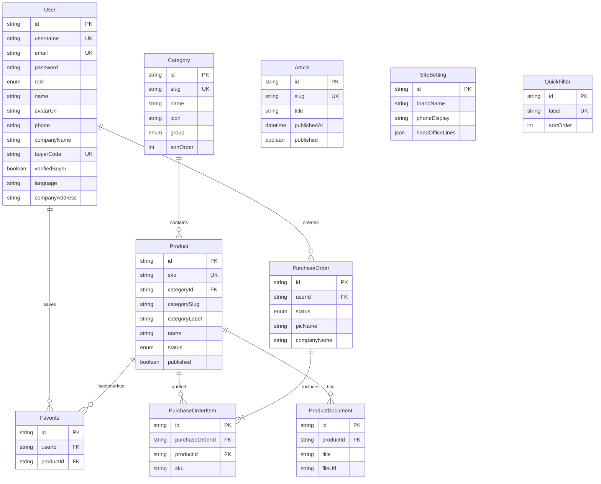

# ERD — Indah Mesin Marketplace

Struktur database selaras dengan layar Stitch / shop: beranda & artikel, kategori & filter, detail produk, favorit, PO preview, profil, kontak, dan admin.

## Diagram (Mermaid)



## Pemetaan layar → tabel

| Layar / fitur | Tabel utama |
|---------------|-------------|
| Login / Admin | `User` |
| Beranda artikel | `Article`, `Category` (group BERANDA), `QuickFilter`, `Product` |
| Categories & filter | `Category` (MARKETPLACE, FILTER), `Product` |
| Detail produk | `Product`, `ProductDocument` |
| Favorites | `Favorite`, `User`, `Product` |
| PO Preview | `PurchaseOrder`, `PurchaseOrderItem`, `User` |
| Profile | `User` (profil perusahaan & buyer) |
| Contact | `SiteSetting` |
| Admin dashboard | Semua tabel (statistik & CRUD) |

## Enum

- **Role:** `USER`, `ADMIN`, `SUPERADMIN`
- **ProductStockStatus:** `READY`, `INDENT`, `CONTACT`
- **CategoryGroup:** `MARKETPLACE`, `FILTER`, `BERANDA`
- **PurchaseOrderStatus:** `DRAFT`, `SUBMITTED`, `WHATSAPP_SENT`

## Akses admin

- URL: **`http://localhost:3000/admin/login`** → setelah login: **`/admin/dashboard`**
- Langsung (setelah login): **`http://localhost:3000/admin/dashboard`**

| Username | Password | Role | Akses admin |
|----------|----------|------|-------------|
| `user` | `Indah@2026` | USER | Tidak (redirect ke beranda) |
| `admin` | `Indah@2026` | ADMIN | Dashboard + produk |
| `superadmin` | `Indah@2026` | SUPERADMIN | Dashboard + produk + kelola user |

## Perintah database

```bash
npx prisma migrate dev
npx prisma db seed
```
