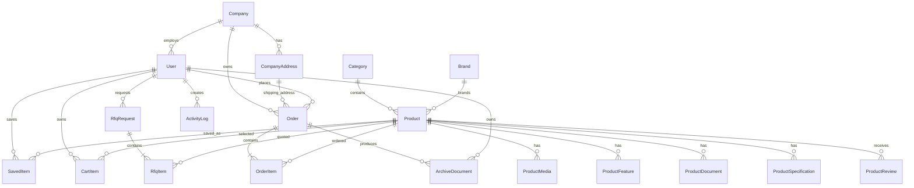

# ERD — MesinBagus Marketplace

Dokumen ini merangkum model yang benar-benar didefinisikan di `prisma/schema.prisma`.

## Relasi utama



## Pemetaan halaman pengguna

| Halaman atau fitur | Model utama |
|---|---|
| Login, register, dan profile | `User`, `Company`, `CompanyAddress` |
| Beranda dan artikel | `Article`, `Category`, `QuickFilter`, `Product` |
| Categories | `Category`, `Product`, `Brand` |
| Detail produk | `Product`, `ProductMedia`, `ProductFeature`, `ProductSpecification`, `ProductDocument`, `ProductReview` |
| Saved products | `SavedItem`, `User`, `Product` |
| Review/Create PO | `Order`, `OrderItem`, `Company`, `CompanyAddress` |
| My Orders | `Order`, `OrderItem` |
| My Docs | `ArchiveDocument` |
| Contact | `SiteSetting` |
| Help Center | `Faq` |
| Request quotation | `RfqRequest`, `RfqItem` |

## Enum

- `Role`: `BUYER`, `PURCHASING`, `APPROVER`, `ADMIN`, `SUPERADMIN`
- `CompanyType`: `BUYER`, `VENDOR`
- `OrderStatus`: `DRAFT`, `SUBMITTED_VIA_WA`, `NEGOTIATING`, `APPROVED`, `CANCELLED`
- `ArchiveDocumentType`: `PO_DRAFT`, `OFFICIAL_QUOTATION`, `INVOICE`, `BROCHURE`
- `VerificationStatus`: `UNVERIFIED`, `PENDING`, `VERIFIED`, `REJECTED`
- `StockStatus`: `READY_STOCK`, `INDENT`, `OUT_OF_STOCK`
- `MediaType`: `IMAGE`, `VIDEO`
- `RfqStatus`: `PENDING`, `PROCESSED`, `QUOTATION_SENT`, `CANCELLED`

## Migration dan seeder

Migration development:

```bash
npx prisma migrate dev
```

Migration production:

```bash
npx prisma migrate deploy
```

Seeder:

```bash
npx prisma db seed
```

Seeder bersifat idempotent dan mengisi akun demo, perusahaan, alamat, kategori, produk, media, fitur, spesifikasi, dokumen produk, artikel, filter, site settings, FAQ, saved products, review, RFQ, order, serta archive document.
